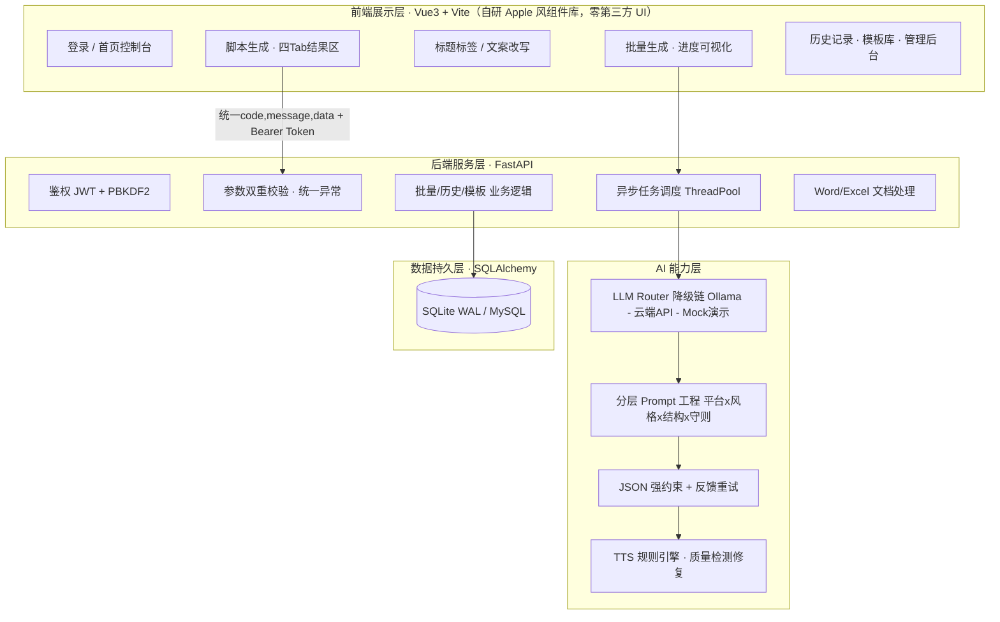

# AI 内容工场 · 一站式短视频&文案智能生产平台

面向自媒体创作者、短视频运营、电商文案人员的 **AI 全自动内容生产工具**：
输入一个主题，10 秒产出可开拍的完整短视频脚本套装（分镜脚本 + 爆款标题 + 分层标签 + 配音文稿 + 标准 Word 交付），
并支持六大风格文案改写、批量异步量产、历史记录与自定义模板沉淀。

> 技术栈：**FastAPI + Vue3/Vite（自研 Apple 风组件库）+ Ollama 本地推理（云端降级、Mock 兜底）+ SQLite/MySQL 双兼容 + Docker 一键部署**

---

## 目录

- [功能全景](#功能全景)
- [系统架构](#系统架构)
- [快速开始（本地开发）](#快速开始本地开发)
- [快速开始（Docker 一键部署）](#快速开始docker-一键部署)
- [环境配置说明](#环境配置说明)
- [API 一览](#api-一览)
- [核心设计亮点（面试专用讲解提纲）](#核心设计亮点面试专用讲解提纲)
- [质量保障与自检](#质量保障与自检)
- [简历项目描述（可直接使用）](#简历项目描述可直接使用)
- [开发路线与目录结构](#开发路线与目录结构)

---

## 功能全景

| 模块 | 能力 | 状态 |
| --- | --- | --- |
| 模块1 · AI 短视频脚本生成 | 主题+平台+时长+风格 → 主题概述 / 3 秒爆款钩子 / 分镜脚本（时间精准+画面+台词+字幕）/ 结尾互动，时长强对齐 | ✅ |
| 模块2 · 爆款标题&标签 | 10 组差异化标题（悬念/干货/共鸣/提问，自动去重），三层标签矩阵（热门泛/行业中/精准长尾），二次润色 | ✅ |
| 模块3 · 智能文案编辑 | 6 大商用风格库 + 自定义风格；改写 / 扩写 / 缩写 / 风格迁移 / 逻辑重构 / 纠错 / 原创度提升 | ✅ |
| 模块4 · 批量内容生成 | TXT/CSV/Excel 导入，后台异步量产全套内容，进度实时可视化、失败不中断、结果打包下载 Excel | ✅ |
| 模块5 · TTS 配音文本 | 剔除书面化语句/语气填充词、长句智能断句、冗余标注剥离、旁白/出镜识别，直接进剪映配音 | ✅ |
| 模块6 · Word 标准导出 | python-docx 交付级排版：微软雅黑、章节自动编号、分镜表格、页脚页码 | ✅ |
| 模块7 · 历史记录 | 永久留存、关键词/类型/平台/时间检索、二次编辑、一键复用、软删除+恢复 | ✅ |
| 模块8 · 自定义模板 | 脚本模板 / 风格模板 / Prompt 模板分类管理，命名、复用、编辑 | ✅ |

## 系统架构

```
┌──────────────────────────────────────────────────────────────┐
│ 前端展示层  Vue3 + Vite 自研 Apple 风组件库（零第三方 UI 依赖） │
│  登录 / 首页控制台 / 脚本生成 / 标题标签 / 文案改写 / 批量 /    │
│  历史 / 模板 · 异步任务进度 · 结果预览 · 一键复制 · 文档导出    │
└──────────────┬───────────────────────────────────────────────┘
               │ REST (统一 {code,message,data}) + JWT Bearer
┌──────────────▼───────────────────────────────────────────────┐
│ 后端服务层  FastAPI（异步框架 + 自动文档）                     │
│  鉴权 · 参数双重校验 · 统一异常捕获 · 日志 · 异步任务调度       │
│  内容记录 / 模板 / 批量任务 业务逻辑 · Word/Excel 文档处理      │
└──────────────┬───────────────────────────────────────────────┘
               │
┌──────────────▼───────────────────────────────────────────────┐
│ AI 能力层（工程化收口）                                        │
│  分层 Prompt 工程（平台画像×风格画像×结构约束×输出守则）        │
│  LLM Router：Ollama 本地 → 云端 OpenAI 兼容 → Mock 演示        │
│     · 超时重试 · Token 截断 · JSON 强约束 · 校验失败反馈重试    │
│  确定性 TTS 规则引擎 · 内容质量检测与自动修复                  │
└──────────────┬───────────────────────────────────────────────┘
               │ SQLAlchemy（SQLite WAL / MySQL 仅切换 URL）
┌──────────────▼───────────────────────────────────────────────┐
│ 数据持久层  user · content_record · custom_template ·          │
│            batch_task_log（四表，含批量失败日志详情）           │
└──────────────────────────────────────────────────────────────┘
```

**Mermaid 架构图**（GitHub 直接渲染）：



## 快速开始

### 方式一：一键启动（推荐 · 本地开发）

**双击即用 / 单命令运行整套项目**，无需任何手工安装命令：

```bash
# Windows 双击 start.bat —— 可见控制台模式（适合调试，实时看到全部日志）
# Windows 双击「AI内容工场-后台启动.lnk」—— 隐藏后台模式（推荐，已在项目根目录和桌面上）
#   （它用 pythonw 直接启动，不弹任何窗口；日志写入 backend\logs\launcher.log；
#     不依赖 VBS 脚本，任何安装了 Python 的机器都能用）
# Windows 双击 start-hidden.vbs —— VBS 隐藏模式（备用，需系统允许运行 VBS 脚本）
# Windows 双击 stop.bat —— 停止全部服务（隐藏模式无控制台，用它一键停止）
# macOS / Linux：./start.sh
# 或等效命令：
python backend/start.py
```

> 快捷方式指向本机 pythonw.exe；换电脑后如在桌面上点不开，可双击项目根目录的
> `创建后台启动快捷方式.cmd` 重新生成（或直接用 start.bat）。

`start.py` 自动完成 6 步：**环境校验 → 虚拟环境自举（.venv）→ 依赖安装 → .env 生成与加载 → 数据库初始化 → 模型链健康检查 → 前端+后端同时拉起 → 自动打开浏览器**。

常用参数：

```bash
python backend/start.py --check           # 只做环境体检（Python/Node/端口/Ollama）
python backend/start.py --no-frontend     # 仅启动后端 API
python backend/start.py --port 8080       # 指定后端端口（被占用自动顺延）
python backend/start.py --no-browser      # 不自动打开浏览器
```

> 只需 Python 3.10+ 即可（Node 缺失时自动降级为仅后端；Ollama 未安装时自动降级到云端/Mock 演示模式）。
> 国内网络可设 `ACP_PIP_INDEX`、`ACP_NPM_REGISTRY` 环境变量切换镜像源。
> 配置修改统一在 `backend/.env`（首次启动自动生成，含模型 Key / 端口 / 超时 / 批量参数）。

作为开发模式对照，也可以分开手动启动：

```bash
# 后端
cd backend
uvicorn app.main:app --reload --port 8000     # 接口文档 http://127.0.0.1:8000/docs
# 前端（另开终端）
cd frontend && npm install && npm run dev      # http://127.0.0.1:5173（自动代理 /api）
```

### 方式二：Docker 一键容器化部署

```bash
# Windows：双击 start-docker.bat；macOS/Linux：./start-docker.sh
# 等效单命令：
docker compose up -d --build

# 前端: http://localhost        后端API: http://localhost:8000/docs
# 停止: docker compose down（或 stop-docker.bat）
```

- 镜像内置健康检查，**后端就绪后前端才启动**，数据(./data)与日志(./logs)挂载持久化；
- 本机已装 Ollama 时容器自动经 `host.docker.internal` 直连宿主机模型；
- 无本地 Ollama 时启用容器化模型：`docker compose --profile ollama up -d` 后执行
  `docker exec acp-ollama ollama pull qwen2.5:7b`；
- 端口/云端 Key/镜像源等可在根目录 `.env` 覆盖（参照根目录 `.env.example`）；
- 国内构建加速：`docker compose build --build-arg PIP_INDEX_URL=https://pypi.tuna.tsinghua.edu.cn/simple --build-arg NPM_REGISTRY=https://registry.npmmirror.com`。

> 前置要求：安装 Docker Desktop 并保持运行。

### 一键启动常见问题（FAQ）

| 现象 | 原因与解决 |
| --- | --- |
| 双击 start.bat 弹出「Windows 找不到文件 .py」 | 旧版 bat 换行符损坏（已修复）；请重新运行**根目录的 start.bat**，不要双击 backend/start.py |
| 窗口出现乱码 | 本机未安装 Python：请安装 Python 3.10+ 并勾选 "Add to PATH"，重试 `py -3`/`python` 任一可用即可 |
| 前端打不开 | 仅需后端时用 `start.py --no-frontend`；或到 `frontend/` 手动 `npm install && npm run dev` |
| 生成内容提示"演示模式" | Ollama 未运行或模型未拉取：`ollama serve` + `ollama pull qwen2.5:7b`；或在右上角「模型配置」填 `CLOUD_API_KEY` |
| 端口被占用 | start.py 自动顺延（后端 8000-8009，前端 Vite 自动 +1），启动日志会显示实际端口 |
| pip/npm 下载慢 | `set ACP_PIP_INDEX=https://pypi.tuna.tsinghua.edu.cn/simple` 与 `set ACP_NPM_REGISTRY=https://registry.npmmirror.com` |
| 前端构建偶发 node 崩溃 (0xC0000409) | 本机内存/提交内存不足所致；用 `npm run build:lowmem` 或 `npm run build` 重试（prebuild 已自动清理旧产物）。若频繁失败请关闭其他吃内存的进程后重试，Docker 构建在干净容器内不受影响 |
| 用了 start-hidden.vbs 后怎么停/看日志 | 双击根目录 `stop.bat` 一键停止；日志在 `backend\logs\launcher.log`（覆盖式写入，每次启动刷新） |

## 面试演示操作指南（照着做，10 分钟完整 Demo）

> 目标：**任何机器、任何网络环境下都不会翻车**。核心思想：演示数据模式保底 + 真实模型加分。

### 准备工作（3 分钟）

1. **双击 `start.bat`** 一键启动（首次自动装依赖）。确认结尾出现：
   `◆ollama ✓ 可用 模型 qwen2.5:7b 就绪`（或弹提示条说明已降级——不影响演示）。
2. 浏览器自动打开 → 登录页 → 输入 **admin / admin123**（首次启动自动创建）。
3. 点右上角 🟢 状态点 → 状态弹窗确认「模型推理链」三行状态；点「模型配置」确认 Ollama 地址与模型名。
4. 打开右上角「演示」开关（**屏幕右上角出现提示条 = 演示模式就绪，任何环境不翻车**）。

### 演示流程（6-8 分钟）

1. **首页**（30s）：介绍四层架构与三大亮点（分模块卡片），点右上角提示条展示「云端不可用自动降级」文案。
2. **短视频脚本**（2min）：输入主题「普通人如何用 AI 工具实现副业变现」，选抖音/60s/抖音口播干货风，点生成。
   - 演示模式下秒出；若 Ollama 就绪，可关演示来一次真实生成（输出标注模型 qwen2.5:7b）。
   - 展示四个 Tab 切换：分镜脚本 → 爆款标题 → 话题标签 → **TTS 配音文稿**（强调"可直接进剪映"）。
   - 点「复制」展示 toast；点「导出 Word」保存文档（强调交付级排版）。
3. **文案改写**（1min）：粘贴一段原文 → 选"极简高级短句风"+精炼缩写 → 展示左侧输入/右侧实时输出，点「保存为模板」。
4. **批量生成**（2min）：点「下载导入模板」→ 编辑 5 条主题 → 拖拽上传 → 任务卡展示进度条实时推进 → 完成后「下载 Word」打包 zip。
5. **降级与容错**（1min）：关掉演示开关并临时停 Ollama（`taskkill ollama` 或右上角模型配置把地址改错）→ 再次生成 → 展示**错误卡片 + 排查指引**，打开演示开关 → 秒恢复。这是全链路容错的最佳佐证。
6. **管理后台**（1min）：导航末尾「管理」→ 新增用户/重置密码/查看系统日志（展示日志行，说明可溯源）。

### 被追问时的 3 个深度亮点

1. **结构化输出强约束**：讲 `format=json + 防御性解析 + Pydantic Schema 校验 + 校验失败回喂纠错重试`，证明"10 组标题永不缺字段"不是运气。
2. **双模型降级链**：讲 `ollama → cloud → mock` 的顺序语义：网络/服务错误才降级，输出不合规不静默降级（避免数据失真）。
3. **确定性 TTS 规则引擎**：为什么不用 LLM 做配音稿优化——零幻觉、零延迟、可复现、批量高并发，规避"AI 篡改口播稿"的商用风险。

## 功能截图（演示时可自行截取）

登录页 → 首页控制台 → 脚本生成（四 Tab）→ 文案改写 → 批量任务卡 → 历史记录网格 → 模板库 → 管理后台 → 模型配置弹窗。

## 环境配置说明

后端全部配置抽离在 `backend/.env`（一键启动时自动生成，模板为 `.env.example`），核心项：

| 配置项 | 说明 | 默认 |
| --- | --- | --- |
| `LLM_PROVIDER_PRIORITY` | Provider 链，**顺序即降级顺序** | `ollama,cloud,mock` |
| `OLLAMA_BASE_URL` / `OLLAMA_MODEL` | 本地模型地址与模型名 | `http://localhost:11434` / `qwen2.5:7b` |
| `CLOUD_BASE_URL` / `CLOUD_API_KEY` / `CLOUD_MODEL` | 任意 OpenAI 兼容接口（DeepSeek/通义/OpenAI） | 空（未启用） |
| `DATABASE_URL` | SQLite（本地）/ MySQL（生产），仅切 URL | `sqlite:///./data/app.db` |
| `LLM_MAX_TOKENS` / `LLM_RETRIES` / `LLM_TIMEOUT` | Token 截断、重试、超时 | `4096` / `2` / `180` |
| `BATCH_MAX_WORKERS` | 批量并发线程数（保护本地模型） | `2` |

## API 一览

统一响应 `{code, message, data}`，`code=0` 为成功；错误码：1001 参数、1002 鉴权、
1004 不存在、2001 模型不可用、2002 输出校验失败。

| 方法 | 路径 | 说明 |
| --- | --- | --- |
| POST | `/api/v1/auth/register` `/login` | 注册 / 登录（PBKDF2 加密存储 + JWT） |
| POST | `/api/v1/script/generate` | 短视频脚本套装生成 |
| POST | `/api/v1/titles/generate` | 10 标题 + 三层标签（支持二次润色） |
| POST | `/api/v1/copywriting/transform` | 七种动作 × 六风格文案处理 |
| POST | `/api/v1/tts/optimize` | TTS 配音文稿优化（规则引擎，秒回） |
| POST | `/api/v1/batch/tasks` / `tasks/upload` | 批量任务创建（JSON / 文件） |
| GET | `/api/v1/batch/tasks/{id}` | 任务进度（总数/成功/失败/条目详情） |
| GET | `/api/v1/batch/tasks/{id}/download` | 结果打包 Excel |
| GET | `/api/v1/history` | 记录检索（关键词/类型/平台/时间，分页） |
| PUT/DELETE | `/api/v1/history/{id}` | 二次编辑 / 软删除（POST `/restore` 恢复） |
| GET/POST/PUT/DELETE | `/api/v1/templates` | 自定义模板 CRUD |
| POST/GET | `/api/v1/export/script` `/export/record/{id}` | Word 导出 |
| GET | `/api/v1/system/status` | 模型链健康状态 |

## 核心设计亮点（面试专用讲解提纲）

1. **分层可配置 Prompt 工程**：平台画像、风格画像、时长字数预算、JSON 结构说明、输出守则
   五层独立模板，新增平台/风格只是"登记一条画像"，业务代码零硬编码。
2. **LLM 结构化输出强约束**：`format=json`（Ollama）/ `response_format`（云端）双保险 +
   防御性解析（围栏剥离、括号深度扫描）+ Pydantic Schema 校验；
   校验失败自动把**错误原因回喂模型纠错重试**，从根上解决字段缺失、格式混乱。
3. **双模型降级链**：Ollama 本地离线 → 云端 API → Mock 演示数据；网络类失败单 Provider 重试后降级，
   输出类不合规不静默降级（避免数据失真），全链可用性 7×24。
4. **异步批量任务调度**：接口秒回 task_id，ThreadPoolExecutor 后台执行，DB 逐条落盘进度；
   单条失败记录进 `batch_task_log.items` 不中断整批；支持取消、耗时统计、结果打包下载。
5. **确定性 TTS 规则引擎**：配音文本优化用规则而非 LLM——零幻觉、零延迟、可复现、可批量，
   同时规避了"AI 改写口播稿篡改原意"的商用风险。
6. **全链路工程容错**：入参双重校验（Schema + 业务层）、超时/重试、Token 截断、
   统一异常捕获（业务异常区分 6 类错误码）、日志滚动落盘、SQLite WAL 防并发写锁。

## 质量保障与自检

- 后端自带全链路冒烟测试 `backend/tests/smoke_test.py`（13 项断言：鉴权、八模块接口、
  时长强约束、文档导出字节校验、批量成败统计、软删除恢复等）；
- 脚本生成后自动质检修复：分段总时长==视频时长（自动对齐）、标题去重、标签规范化、
  字幕截断、镜头类型白名单、字数预算偏差提示；
- 依赖极简（FastAPI/SQLAlchemy/httpx/python-docx/openpyxl/PyJWT），无臃肿框架；
  口令使用 PBKDF2-HMAC-SHA256（20 万次迭代 + 随机盐），零第三方鉴权库风险。

## 简历项目描述（可直接使用）

**项目名称**：AI 一站式短视频文案与脚本生产助手（全栈独立开发）

**项目描述**：独立开发一款面向自媒体运营的 AI 原生内容生成系统，基于 FastAPI 异步框架结合大模型技术栈，
实现短视频结构化脚本生成、多平台爆款标题标签产出、多风格文案智能改写、批量异步内容量产、
TTS 配音文本专项优化及标准化 Word 导出全链路商用能力。系统采用分层 Prompt 工程架构，模块化拆解
生成参数，通过强制结构化输出约束解决大模型随机性、幻觉、格式混乱等行业痛点。设计云端 API 与本地
Ollama 双模型适配方案，实现模型自动降级兜底，兼顾生成质量与离线免费部署能力。同时完善历史记录管理、
自定义模板、全链路异常容错、异步任务调度等工程化能力，搭配 Apple 官网极简高级 UI，打造出一套功能完整、
体验流畅、可直接商用的 AI 内容量产工具。

**技术亮点**：分层 Prompt 工程、LLM 输出强约束（JSON Schema + 反馈重试）、异步批量任务调度、
双模型智能降级、确定性 TTS 规则引擎、全链路工程容错、Docker 容器化部署、自研 Apple 风 Vue3 组件库。

## 开发路线与目录结构

```
├── start.bat / start.sh           # 🚀 一键启动（可见模式：自动装环境+拉服务+开浏览器）
├── start-hidden.vbs               # 🚀 一键启动（隐藏后台模式，日志→ backend\logs\launcher.log）
├── stop.bat                       # 🛑 一键停止全部服务
├── start-docker.bat / start-docker.sh  # 🚀 一键容器化启动
├── stop-docker.bat / stop-docker.sh    # 停止容器
├── .env.example                   # Docker 部署覆盖配置模板
├── docker-compose.yml             # 一键容器化编排（含健康检查/持久化/可选Ollama）
├── backend/
│   ├── start.py                   # 一键启动器（环境校验/venv自举/依赖安装/DB初始化/双端拉起）
│   ├── app/
│   │   ├── main.py                # 入口：异常处理器 / CORS / 路由挂载
│   │   ├── config.py              # 全部配置（.env 可覆盖）
│   │   ├── core/                  # 日志 · 异常体系 · 统一响应 · 安全(PBKDF2+JWT)
│   │   ├── db/                    # SQLAlchemy 引擎 + 四表模型
│   │   ├── schemas/               # 入参 Schema（框架层一重校验）
│   │   ├── services/
│   │   │   ├── llm/               # Provider 抽象 / Ollama / Cloud / Mock / Router
│   │   │   ├── prompts/           # 分层模板 + Builder + 输出 Schema
│   │   │   └── *.py               # 八模块业务服务
│   │   ├── api/v1/                # 各模块路由（模块化解耦）
│   │   └── utils/                 # 批量文件解析等
│   ├── tests/smoke_test.py        # 全链路冒烟测试
│   ├── requirements.txt           # 完整依赖清单（含用途注释）
│   ├── .env / .env.example        # 环境配置（模型Key/端口/超时/批量参数）
│   └── Dockerfile
├── frontend/
│   ├── src/components/ui/         # 自研 Apple 风组件（Button/Card/Select/Toast/ConfirmDialog…）
│   ├── src/components/            # 模型配置/状态/改密/错误卡片/保存模板 等业务组件
│   ├── src/views/                 # 9 大页面（含管理后台）
│   ├── src/stores/ · api/ · router/
│   ├── package.json / vite.config.js / Dockerfile / nginx.conf
├── docs/CHECKLIST.md              # 开发自检清单（发布前逐项打勾）
├── docs/API.md                    # 接口说明（含标准分页/错误码）
├── docs/MODULES.md                # 模块说明 + Mermaid 业务流程图
├── docs/test_case.md              # 测试用例文档（正常/边界场景）
├── backend/sql/init.sql           # 数据库建表脚本（SQLite/MySQL 双方言）
└── README.md
```

---

**接口文档**：启动后访问 `http://127.0.0.1:8000/docs`（Swagger 自动生成，可在线调试）。
