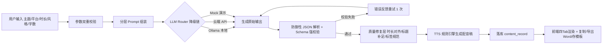
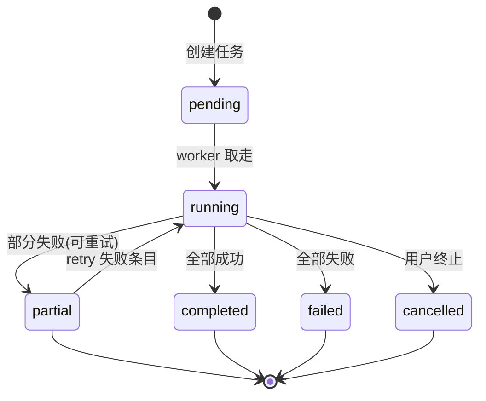

# 模块说明与业务流程图

## 模块总览

| 模块 | 职责 | 关键文件 |
| --- | --- | --- |
| 认证安全 | 登录（仅登录模式）、PBKDF2 口令、JWT、管理员守卫 | `app/api/v1/auth.py` `app/core/security.py` |
| 脚本生成 | 全套结构化脚本 + 质检修复 + 存档 | `app/services/script_service.py` |
| 标题标签 | 10 标题 + 三层标签 + 二次润色 | `app/services/title_service.py` |
| 文案改写 | 7 动作 × 6 风格 + 自定义 | `app/services/copywriting_service.py` |
| TTS 文本 | 确定性规则引擎（零幻觉） | `app/services/tts_service.py` |
| 批量生成 | 线程池异步 + 进度落库 + 重试 + 打包 | `app/services/batch_service.py` |
| 历史记录 | 分页检索/复用/软删/批量导出 | `app/services/history_service.py` |
| 模板库 | 三类模板 CRUD + 一键使用 | `app/services/template_service.py` |
| 文档导出 | docx 交付级排版 / zip 打包 | `app/services/export_service.py` |
| LLM 层 | Provider 抽象 + 降级链 + 强约束解析 | `app/services/llm/*` |
| Prompt 层 | 分层工程：平台×风格×结构×守则 | `app/services/prompts/*` |
| 管理后台 | 用户管理 + 系统日志（仅管理员） | `app/api/v1/admin.py` |

## 脚本生成业务流（核心链路）

## 批量任务状态机

## 工程化要点扩展（面试讲解可用）
1. Provider 语义：**网络/服务错误才降级**；输出不合规不静默降级（数据可信优先）。
2. 任务索引列用 SQLAlchemy 嵌套变更 `flag_modified` 显式标记——JSON 原地赋值不会触发脏检测。
3. LLM 级约束与产品承诺解耦：模型输出质量由"质量修复层"兜底（标题恒 10 组、时长恒精确）。
4. 默认线程池 + 可选 Celery（`app/tasks/`）：接口与业务零改动即可横向扩展。
